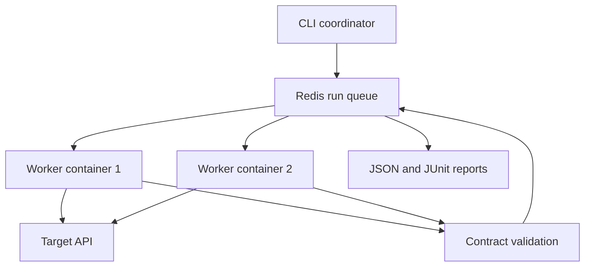

# checker.api
Aloha! This is checker.api, your new testing suite friend, go ahead and try me!

**Distributed API Test Automation for Containerized Services**

A complete Python project that distributes API test cases across independently running workers, uses a thread pool inside each worker, validates requests and responses against a consumer-owned OpenAPI 3.1 contract, and returns a failing CI status when tests fail or results are missing.

The implementation includes a runnable inventory-and-orders service, deterministic fixtures, worker-crash recovery, atomic JSON/JUnit reports, Docker Compose, a locked dependency graph, and GitHub Actions gates. This is a production-oriented foundation with explicit operating limits; deploying it into your environment still requires configuring credentials, Redis durability, target access, and required repository checks.

## To Start with Docker

Requirements: Docker Engine or Docker Desktop with Compose v2, Bash, and Python 3 for generating run IDs. No Python dependencies need to be installed on the host for this route.

```bash
bash scripts/docker_demo.sh
```

This builds the image, starts an isolated Redis instance and demo API, runs **two worker containers with four threads each**, executes eight acceptance cases, copies the reports into `reports/docker-<run-id>/`, and removes the demonstration containers and volumes. The script preserves the coordinator's exit code.

```bash
# Change worker and thread counts.
WORKERS=3 WORKER_THREADS=4 bash scripts/docker_demo.sh

# Deliberately introduce a response-type regression. Expect exit code 1.
DEMO_BREAK_CONTRACT=true bash scripts/docker_demo.sh
```

The demo's shared token is suitable only for its isolated internal Docker network. The sample does not publish Redis or API ports to the host.

## Run and develop locally

Requirements: Python 3.12 or 3.13, uv 0.12.8, and Redis 6.2+ for distributed execution. The container/CI configuration targets Redis 7.4. Python 3.12 and Redis 6.2.14 were exercised in the supplied local verification; other combinations are not claimed as locally verified.

```bash
python -m pip install uv==0.12.8
uv sync --frozen --extra demo --group dev

# Validate the suite and consumer contract before sending traffic.
uv run --frozen sentinel validate \
  --suite examples/suites/smoke.json \
  --contract examples/contract.json
```

In terminal 1:

```bash
export TEST_SUPPORT_TOKEN='local-development-token'
export DEMO_ENABLE_TEST_SUPPORT=true
uv run --frozen uvicorn examples.demo_api.app:app --host 127.0.0.1 --port 8000
```

In terminal 2:

```bash
export TEST_SUPPORT_TOKEN='local-development-token'
uv run --frozen sentinel run \
  --suite examples/suites/smoke.json \
  --contract examples/contract.json \
  --base-url http://127.0.0.1:8000 \
  --concurrency 4 \
  --report-dir reports/local
```

Local mode needs no Redis. It runs the same validation and fixture logic as distributed mode.

For a real-process verification of the complete project, including a deliberately killed worker and a benchmark:

```bash
# Starts a temporary Redis instance and temporary demo APIs, then cleans them up.
uv run --frozen python scripts/dev_check.py

# Alternatively supply an installed redis-server executable explicitly.
uv run --frozen python scripts/dev_check.py --redis-server /absolute/path/to/redis-server
```

The script runs lint, formatting checks, the tests against both emulated and real Redis, multi-process acceptance, SIGKILL recovery, and deliberate regression detection. See `docs/VERIFICATION.md` for the evidence bundled with this release.

## What the project implements

| Capability | Behavior |
| --- | --- |
| Distributed execution | Redis atomically assigns whole cases to independent worker processes/containers. |
| Multithreading | Each worker has a bounded `ThreadPoolExecutor` and a bounded shared HTTP connection pool. |
| Contract validation | OpenAPI 3.1 JSON body schemas, scalar parameters, declared response status/media type/headers, JSON Pointer assertions, and optional latency limits. |
| Deterministic data | A fixed seed generates the same values; run/case/delivery namespaces isolate parallel attempts. |
| Recovery | Expired leases are reclaimed; a fresh token fences late completions; repeated delivery exhaustion becomes an error. |
| Heartbeats | A dedicated thread renews active leases. Losing the lease stops further steps. |
| CI behavior | Assertion failures return 1. Infrastructure/configuration failures or incomplete runs return 2. |
| Reports | Atomic `results.json` and `junit.xml` output, with per-step timing and delivery counts. |
| Diagnostics | Structured worker events with run ID, case ID, worker ID, delivery, status, and result acceptance. |
| Operational bounds | Per-request timeouts, cooperative case deadlines, response-size checks, run deadlines, queue payload caps, and expiring Redis keys. |

## Architecture



Each worker executes a case's setup, test steps, and teardown sequentially. Different cases run in parallel. The coordinator publishes the contract and suite once, so workers do not read independently drifting contract files. The CLI also publishes the target URL and timeout settings; workers reject a target mismatch. Credentials remain environment references until resolved inside the worker.

For the queue state machine, failure guarantees, and design tradeoffs, read [docs/ARCHITECTURE.md](docs/ARCHITECTURE.md).

## Project layout

| Path | Purpose |
| --- | --- |
| `src/api_sentinel/models.py` | Strict suite, case, step, and result schemas. |
| `src/api_sentinel/contracts.py` | Contract loading, operation resolution, and request/response validation. |
| `src/api_sentinel/executor.py` | HTTP execution, fixtures, assertions, and bounded retry policy. |
| `src/api_sentinel/queue.py` | Atomic Redis Lua scripts, leases, delivery counts, and result fencing. |
| `src/api_sentinel/worker.py` | Thread pools, heartbeats, and signal-driven draining. |
| `src/api_sentinel/coordinator.py` | Run deadlines, result collection, and incomplete-run handling. |
| `src/api_sentinel/reporting.py` | JSON/JUnit reports written by atomic file replacement. |
| `src/api_sentinel/cli.py` | `validate`, `run`, and `worker` commands. |
| `examples/demo_api/app.py` | SQLite-backed inventory and idempotent order API. |
| `examples/contract.json` | Independent, consumer-owned contract. |
| `examples/suites/` | Acceptance suite and 60-case benchmark workload. |
| `tests/` | Unit tests and Redis integration tests. |
| `scripts/` | Docker demo, real-process verification, benchmark, example generator. |
| `.github/workflows/ci.yml` | Quality, container contract, deliberate regression, and release gates. |

## Write a test suite

JSON and YAML are supported. See `examples/suites/smoke.json` for full workflows and [docs/SUITES.md](docs/SUITES.md) for configuration details.

```yaml
version: 1
name: Inventory checks
seed: 42
cases:
  - id: product-details
    replay_safe: true
    setup:
      - name: Seed an isolated catalog
        operation: seedNamespace
        path_params:
          namespace: "${namespace}"
        headers:
          X-Test-Token: "${env:TEST_SUPPORT_TOKEN}"
        json_body:
          seed: "${seed}"
        expect:
          status: 200
    steps:
      - name: Read the first product
        operation: getProduct
        path_params:
          namespace: "${namespace}"
          product_id: product-1
        expect:
          status: 200
          json_equals:
            /name: Phone
          max_latency_ms: 1000
    teardown:
      - name: Remove the isolated catalog
        operation: deleteNamespace
        path_params:
          namespace: "${namespace}"
        headers:
          X-Test-Token: "${env:TEST_SUPPORT_TOKEN}"
        expect:
          status: 204
```

The fixed contract describes what the client expects. Do not regenerate it from the running server during CI, since that could make a breaking implementation change pass against its own changed schema.

## Run workers manually

Start Redis and your API first. Choose one unique run ID and use it in every terminal. Set the same base URL in the coordinator and workers.

```bash
# Terminal 1; repeat in terminal 2 with --worker-id worker-b.
export TEST_SUPPORT_TOKEN='local-development-token'
uv run --frozen sentinel worker \
  --run-id acceptance-001 --worker-id worker-a \
  --base-url http://127.0.0.1:8000 \
  --redis-url redis://127.0.0.1:6379/0 \
  --concurrency 4 --lease-seconds 30 --wait-seconds 120
```

```bash
# Terminal 3: submit and wait for the distributed run.
uv run --frozen sentinel run --distributed \
  --run-id acceptance-001 \
  --suite examples/suites/smoke.json --contract examples/contract.json \
  --base-url http://127.0.0.1:8000 \
  --redis-url redis://127.0.0.1:6379/0 \
  --run-timeout 300 --request-timeout 5 --case-timeout 60 \
  --report-dir reports/distributed
```

Workers handle one run and exit when it finishes. They can start before submission and wait for the plan. Use a new run ID for subsequent runs; retained run IDs are deliberately protected from accidental reuse. `--concurrency` on `run` controls local mode; distributed concurrency is configured on workers.

## Tests, build, and CI

```bash
uv run --frozen ruff check .
uv run --frozen ruff format --check .
uv run --frozen pytest --cov=api_sentinel
uv build
```

By default, real Redis tests are skipped unless `TEST_REDIS_URL` is provided. `scripts/dev_check.py` supplies its own isolated Redis and runs them. The CI workflow provides Redis as a service and requires at least 80% branch-aware coverage.

The container gate runs both a passing suite and an intentionally broken API. The second run must return exactly 1, demonstrating that response-schema regressions block the gate. Downstream release/deployment jobs should depend on `release-gate`. Configure repository branch protection to require the workflow checks; a workflow file alone cannot set repository policy.

## Measure performance honestly

```bash
# With Redis and the demo API running; set DEMO_DELAY_SECONDS=0.02 when starting the API.
export TEST_SUPPORT_TOKEN='local-development-token'
uv run --frozen python scripts/benchmark.py \
  --base-url http://127.0.0.1:8000 \
  --redis-url redis://127.0.0.1:6379/0 \
  --workers 2 --threads 4 --repeats 3
```

The benchmark compares one serial execution slot with two independent worker processes, each using four threads. It excludes one warmup round, alternates the order of runs, and saves raw timings plus the median reduction. Worker startup, fixture requests, validation, and queue overhead are included. Report writing and process teardown are excluded from both timing values.

`reduction = (serial median − distributed median) / serial median × 100`

The original resume bullet's **20%** is a claim to validate against your own workload. It is not hardcoded or promised by this project. The bundled demo includes a deliberate 20 ms service delay, and its measurements must not be presented as production traffic results.

Read [docs/OPERATIONS.md](docs/OPERATIONS.md) before adapting the runner to shared infrastructure.

To examine startup amortization, run the same benchmark with the supplied larger workload:

```bash
uv run --frozen python scripts/benchmark.py \
  --suite examples/suites/throughput.json \
  --output reports/throughput
```

This contains 240 independent cases. Keep the smaller workload's results when comparing it; a larger workload answers a different capacity question.
