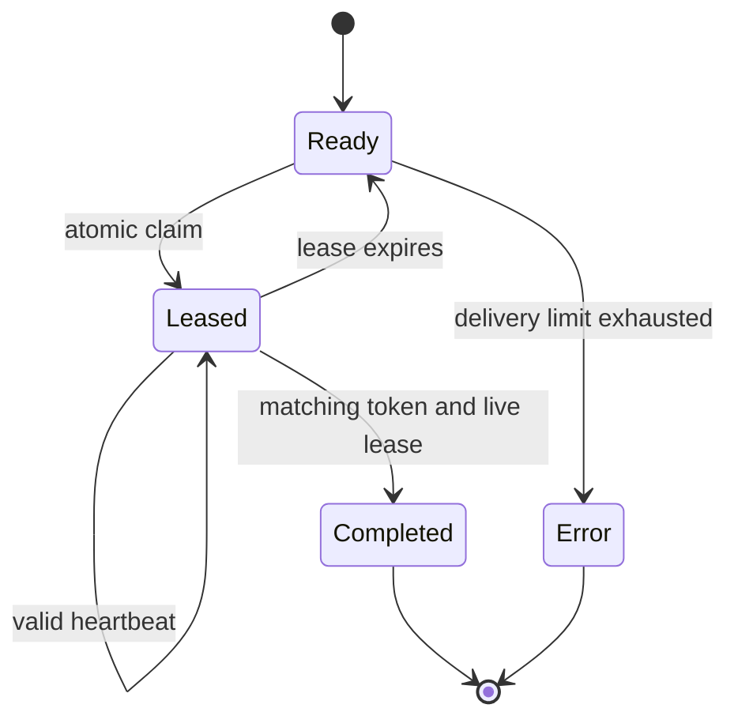

# Architecture and guarantees

## Execution units

The unit of distribution is a **case**, containing ordered setup, test, and teardown steps. Cases are independent and may run in any order. A worker maintains a thread pool; each slot claims one case and completes it before claiming another. HTTPX pools connections across threads and limits the pool to the worker's concurrency.

A run contains a serialized suite, the exact consumer contract, an optional expected target URL, and execution settings. CLI submissions always include the target and timeout settings. The coordinator controls HTTP timeouts for that run. Workers provide their own credentials and concurrency. No environment-derived credential values are expanded by the coordinator or written into Redis by the runner.

## Redis data model

All keys contain the run's `{run_id}` hash tag. The implementation uses a standard Redis client connected to one writable primary; hash-tagged keys make Lua operations colocated if a cluster-aware client is added later. Native Redis Cluster topology discovery and Sentinel failover discovery are not implemented.

| Key suffix | Data type | Contents |
| --- | --- | --- |
| `meta` | Hash | Plan JSON, state, deadline, expiry, maximum deliveries, expected case count. |
| `tasks` | Hash | Original case JSON keyed by case ID. |
| `ready` | Sorted set | Available case IDs; reclaimed work receives priority. |
| `leases` | Sorted set | Claimed case IDs scored by lease expiry in Redis milliseconds. |
| `owners` | Hash | Random ownership token per active claim. |
| `attempts` | Hash | Delivery count per case. |
| `results` | Hash | Accepted terminal result per case. |

Creation, claim/reclaim, renewal, and completion each run atomically in Lua. Scripts use Redis `TIME`, avoiding disagreements between worker clocks. Expiry is absolute: run deadline plus 24 hours by default, including keys created later. Keys are never indefinitely extended by worker activity.

## Claim lifecycle

A completion is accepted only while the run is open, before the run deadline, while the lease is still valid, and when the claim's token matches the current owner. A late worker cannot replace a newer worker's result. Completed results are deduplicated by case ID. Expired jobs are reclaimed during subsequent claim calls; there is no separate reaper service.

The queue intentionally disables automatic Redis command retries. A disconnected response makes the outcome of a mutation ambiguous; resending a claim could acquire a second case. An ambiguous claim is recovered through lease expiration instead.

## At-least-once execution

The system provides **at-least-once case execution** while the run is active and workers/Redis remain available, with bounded redelivery. It does not provide exactly-once HTTP side effects or immunity to Redis data loss.

Namespaces include run ID, case ID, and delivery attempt. A recovering worker receives the same deterministic fixture values in a different namespace. An old worker's in-flight cleanup therefore targets its own attempt's fixtures. Services without namespace support must supply equivalent isolation, idempotency keys, or safe reset semantics. Distributed suites must explicitly declare `replay_safe: true` after those properties are established.

Losing a lease prevents future steps from being sent. An HTTP request already in flight cannot be recalled. Ownership tokens fence result commits in Redis; they are not automatically enforced by the target API.

## Failure behavior

| Failure | Result |
| --- | --- |
| Worker dies before completion | Lease expires; another worker reclaims the case. |
| Old worker returns after recovery | Token/lease check rejects its result. |
| API violates an assertion or response schema | Case fails immediately; no assertion retries. |
| GET connection establishment fails | One connection retry by default, within the case budget. |
| Write or read timeout | Error; no automatic HTTP replay. |
| Setup fails | Test steps stop; teardown is attempted. |
| Teardown fails | Case fails or errors; cleanup failure cannot be hidden by passing tests. |
| Redis fails during execution | Worker stops claiming; lost leases are not trusted. Coordinator fails closed. |
| Maximum deliveries exceeded | Queue creates a terminal infrastructure error. |
| No workers or missing results | Coordinator deadline produces an error entry for every missing case. |
| Duplicate run ID | Submission is rejected without replacing the original run. |
| Coordinator terminates | Run deadline stops new work/result acceptance; no automatic coordinator resume. |

## Validation scope

This project implements an explicit OpenAPI 3.1 subset: JSON request/response schemas using Draft 2020-12 validation, document-local references, unique operation IDs, required scalar path/query/header parameters, response status selection, response headers, JSON Pointer value assertions, and latency budgets. JSON Schema formats available in the installed `jsonschema[format]` checker are asserted.

It does not implement OpenAPI 3.0 conversion, external references, custom parameter styles, cookie parameters, XML, multipart uploads, streaming protocols, dynamic JSON Schema references, schema IDs, security-flow validation, or readOnly/writeOnly direction semantics. Authentication is supplied through headers. JSON null as an explicit request body is not distinguished from an omitted body. Unsupported operations should be converted or extended deliberately before use.

Contracts are trusted repository configuration, not arbitrary untrusted uploaded files. Schema execution is bounded by case/run controls but is not sandboxed against pathological regular expressions or recursive input structures.

## Design references

The random ownership token and conditional release/renewal pattern follows [Redis's ownership guidance](https://redis.io/docs/latest/develop/clients/patterns/distributed-locks/). The project uses one primary and does not implement the multi-primary Redlock algorithm.

HTTP timeout and pool choices follow [HTTPX timeouts](https://www.python-httpx.org/advanced/timeouts/) and [HTTPX resource limits](https://www.python-httpx.org/advanced/resource-limits/).

Schema validation is based on [JSON Schema Draft 2020-12](https://json-schema.org/draft/2020-12). Format checking is enabled explicitly because annotation and assertion behavior differ in the specification.
